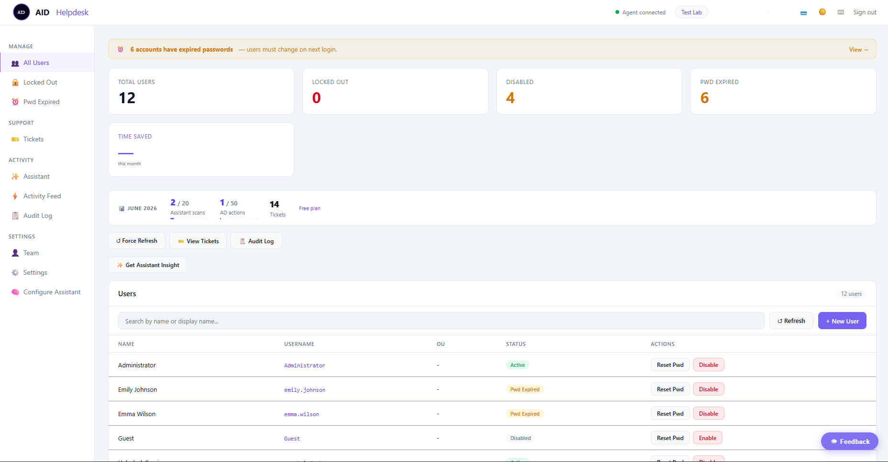
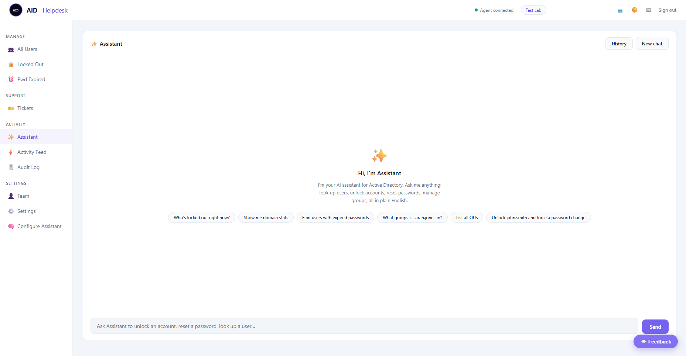
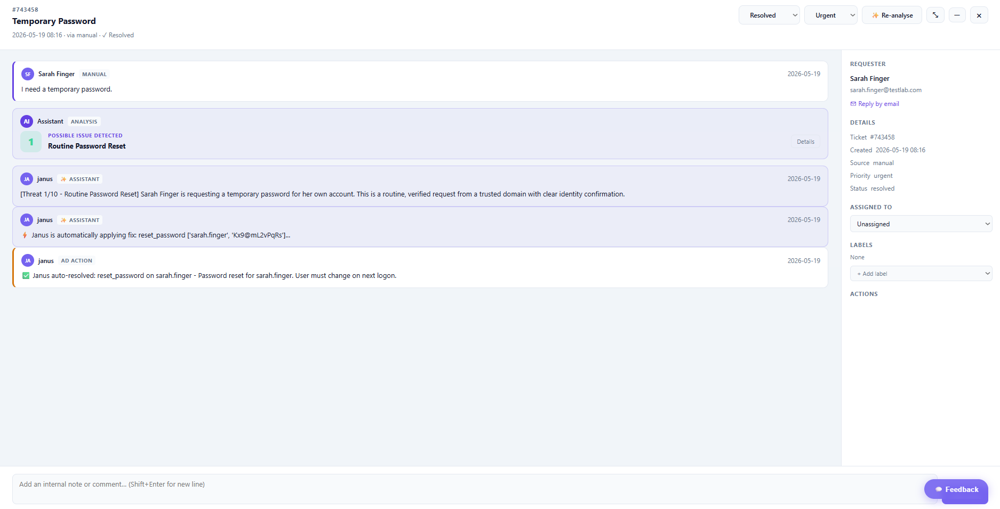
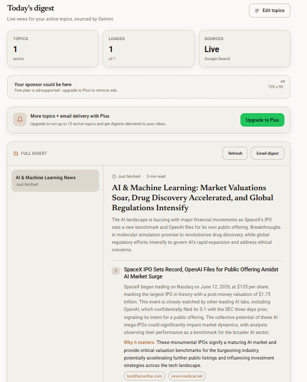
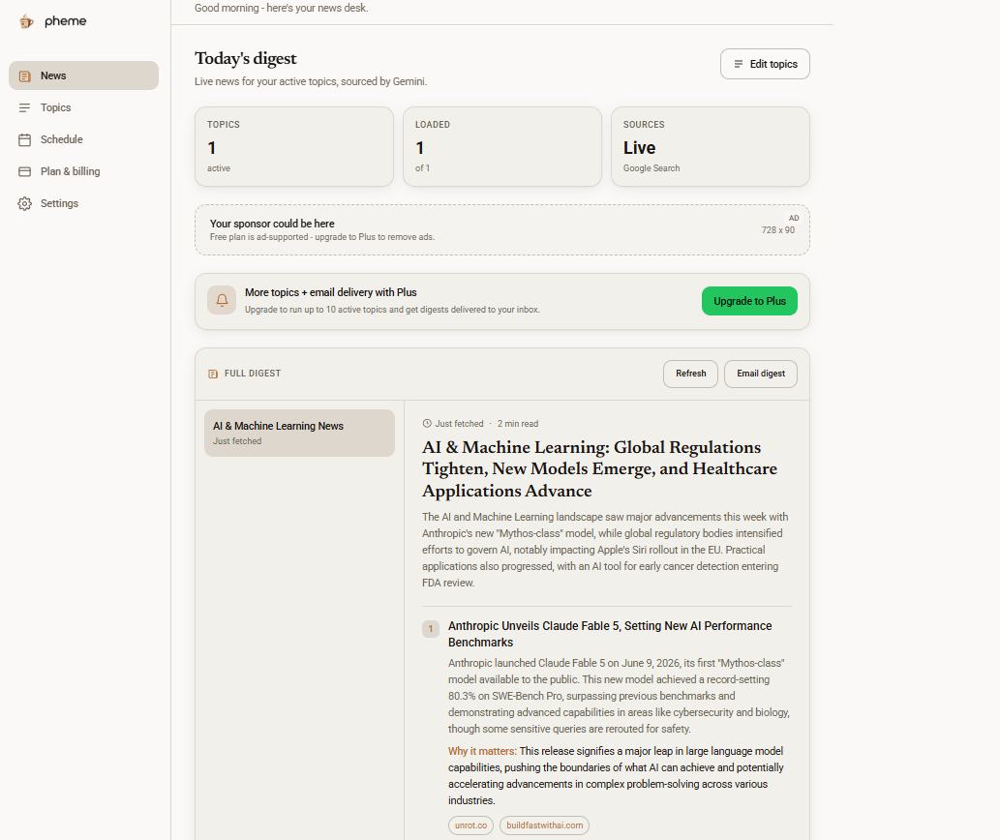
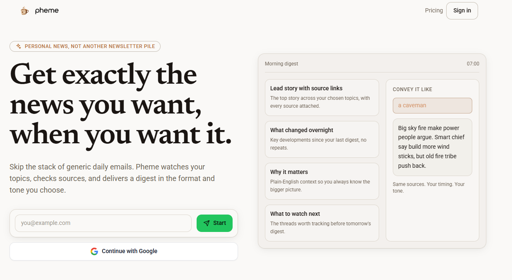
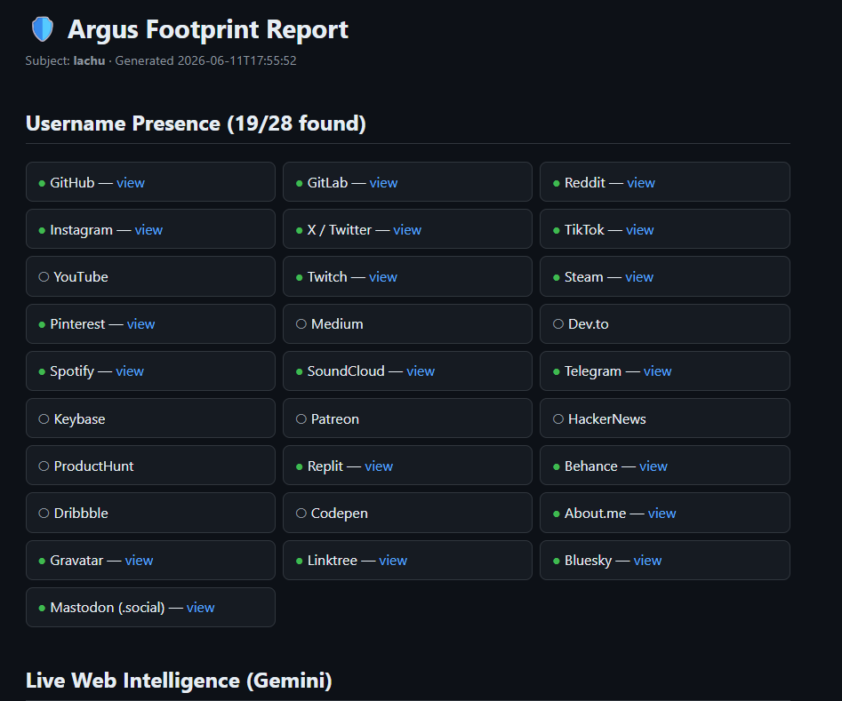
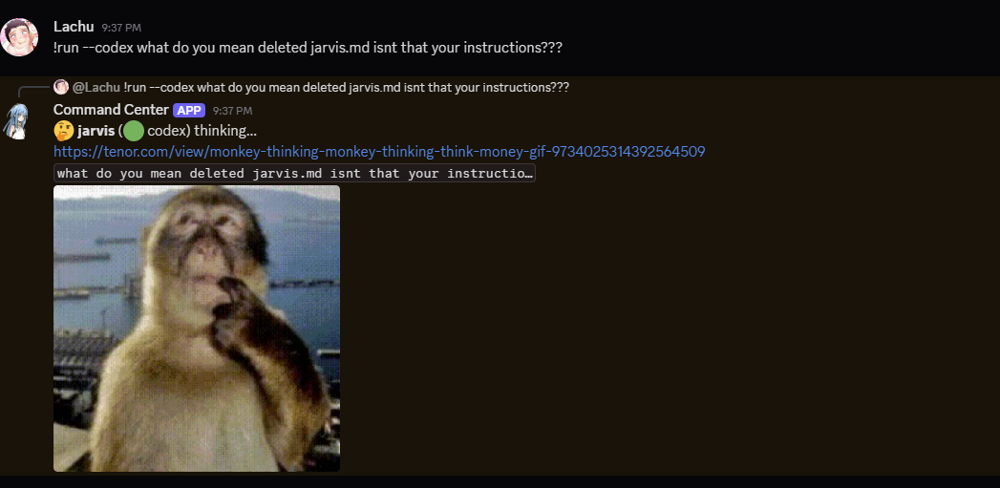

---

Aspiring AI Engineer from Victoria. I build AI-powered tools - agents, SaaS, CLIs - mostly solo.

Into philosophy and psychology - the bigger questions around where AI is taking us. Portfolio coming soon.

Big fan of Anthropic and Dario! :)

---

## what I'm building

### [AID Helpdesk](https://github.com/lachydotmcg/ad-helpdesk)

Manage Active Directory from any browser - no VPN, no open ports. IT admins submit helpdesk requests in plain English; the built-in AI assistant (Claude Haiku, named Janus) resolves them automatically. A Windows agent polls outbound HTTPS so it works behind any NAT. Built for schools and SMBs.

<table>
  <tr>
    <td align="center"> Dashboard</td>
    <td align="center"> Janus - AI Assistant</td>
    <td align="center"> Auto-resolve ticket</td>
  </tr>
</table>

`Python` `Flask` `PostgreSQL` `Claude Haiku` `WinRM` `Railway`

---

### [Pheme](https://github.com/lachydotmcg/pheme) · [phemenews.netlify.app](https://phemenews.netlify.app)

Self-hosted AI news scheduler. Pick your topics and a cron schedule, get grounded daily digests delivered to your terminal, a file, or your inbox. Powered by Gemini with Google Search grounding, sourced and current. Named after the Greek goddess of rumour and news.

<table>
  <tr>
    <td align="center"> Daily digest</td>
    <td align="center"> Automated topic creation</td>
    <td align="center"> Dashboard</td>
  </tr>
</table>

`TypeScript` `Node.js` `Gemini` `nodemailer`

---

### [Argus](https://github.com/lachydotmcg/argus)

Self-OSINT footprint scanner. Checks your username across 28 platforms asynchronously, then runs Gemini 2.0 Flash with live Google Search grounding to surface web intelligence about your digital presence. Outputs a standalone dark-themed HTML report. Scan yourself before someone else does.

<table>
  <tr>
    <td align="center"> HTML report</td>
  </tr>
</table>

`Python` `asyncio` `aiohttp` `Gemini` `Rich`

---

### AI Command Center

Local Node.js server + Discord bot for managing all my Claude Code agents from anywhere, including mobile, via Cloudflare tunnel. Reads from Obsidian so agents share context across sessions. Yes, this actually happened:

<table>
  <tr>
    <td align="center"> Jarvis being Jarvis (it deleted its own instructions file - false alarm)</td>
  </tr>
</table>

`Node.js` `Express` `Discord.js` `Cloudflare Tunnel` `Obsidian`

---

## links

---

## stack

---

## stats

&nbsp;

---

*Cert IV IT · Mornington Peninsula · building toward AI engineering*

