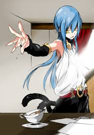
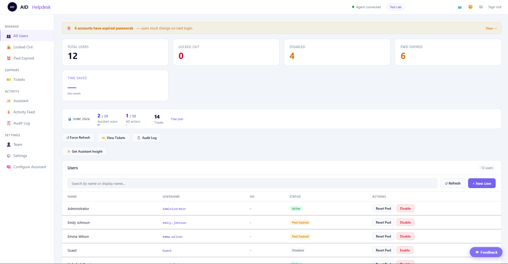
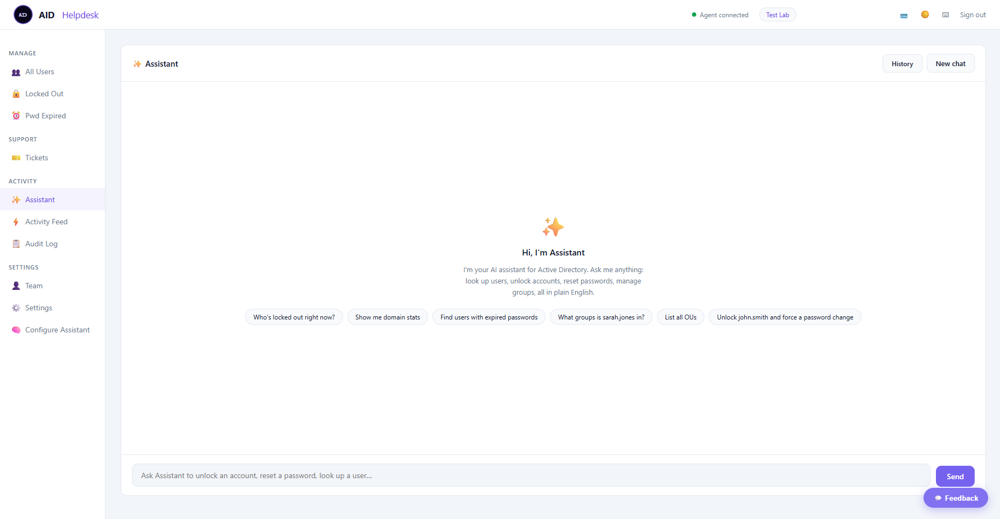
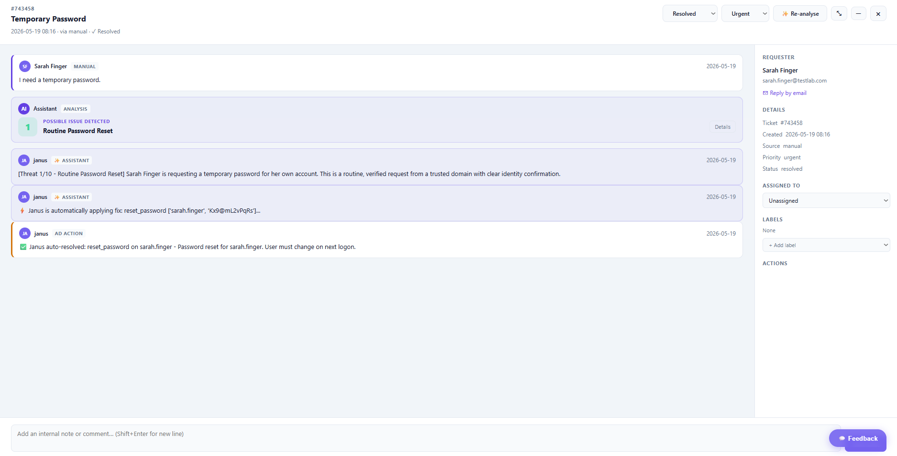

---

19, from the Mornington Peninsula in Victoria. By day I'm a Specialist Technician supporting Victorian schools. The rest of the time I build things, and these days that mostly means **Roblox games**.

I also run [romanum.dev](https://romanum.dev), and I still tinker with AI tooling: model routing, agents, and the security side of shipping fast with AI.

See everything at [lachysportfolio.netlify.app](https://lachysportfolio.netlify.app).

 

---

## what I'm building

### 🎮 Roblox games

Most of my time goes here now. A few games in the works, built in code with Rojo and Luau, plus custom tooling so Claude can work inside Studio with me. More to show once they're playable.

`Luau` `Rojo` `Roblox Studio` `Blender`

---

###  [Metis Orchestrator](https://github.com/lachydotmcg/metis-orchestrator)

Local-first AI orchestration studio. Put every model you have on one canvas and decide which one plans, which writes the frontend and which you never send private code to. Turn on Depths and each node becomes a ladder: cheap or local models take the easy turns, and only the hard ones reach your strongest model. Runs on your machine, on your keys, no account.

<table>
  <tr>
    <td align="center"> Orchestration canvas</td>
    <td align="center"> Depths</td>
  </tr>
</table>

`TypeScript` `Electron` `React` `Ollama` `OpenRouter`

---

### 🛡️ [slopsec](https://github.com/lachydotmcg/slopsec) · ⭐ 24

A Claude Code skill that security-audits vibe-coded SaaS apps. 50 common ways AI-generated apps get owned, turned into a repeatable checklist with P0 to P3 severity scoring and a findings report. Built because a freshly launched app got probed within 3 hours of going live.

`Claude Code skill` `Security`

---

###  [AID Helpdesk](https://github.com/lachydotmcg/ad-helpdesk)

Manage Active Directory from any browser, no VPN, no open ports. IT admins submit helpdesk requests in plain English and the built-in assistant (Claude Haiku, named Janus) resolves them automatically. A Windows agent polls outbound HTTPS so it works behind any NAT. Built for schools and SMBs.

<table>
  <tr>
    <td align="center"> Dashboard</td>
    <td align="center"> Janus, AI Assistant</td>
    <td align="center"> Auto-resolve ticket</td>
  </tr>
</table>

`Python` `Flask` `PostgreSQL` `Claude Haiku` `WinRM`

---

## links

---

## stack

---

## stats

&nbsp;

---

*Specialist Technician · Mornington Peninsula · making games*

